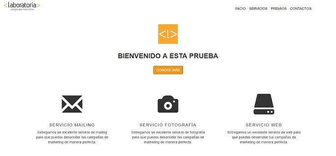

# Lección 33 - Ejercicio Guiado

## El proyecto
Utilizar Bootstrap para desarrollo del ejercicio indicado.

## Captura de pantalla

## Desarrollado con:
`HTML` `CSS` `Bootstrap`

##  Créditos
* [Ruth Salvador](https://github.com/RuthSalvador)
